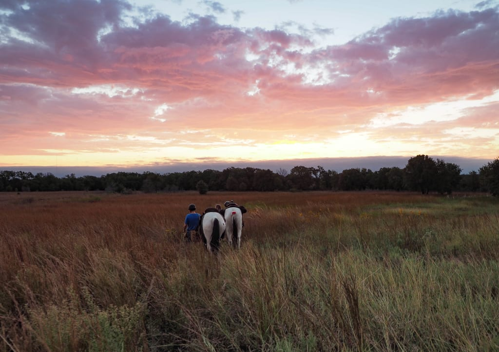

```{r setup, include=FALSE}
knitr::opts_chunk$set(echo = TRUE)
```

```{r}
library(tidyverse)
library(plotly)
library(knitr)
library(DT)
library(readr)
```


# Exercise 1 

## Overview of National Grasslands LBJ



Long through history, the lands that would become the LBJ National Grasslands were favorite hunting grounds for native tribes such as the Cherokee, Creek, Seminole, Waco, and Kickapoo [@dferriero_importance_2021]. In fact, the earliest discovered human artifacts in North America, namely remains of animals, seeds, and various others were discovered not far from this region [@noauthor_fort_nodate; @noauthor_human_2023].

In the 1700s and 1800s, the Comanche commanded this region after aquiring horses and beginning a nomadic war tribe-like lifestyle [noauthor_fort_nodate; @association_comanche_nodate]. In 1843, negotiations between these and other tribes with the likes of Sam Houston's delegate generals, Edward J. Tarrant and George W. Terrell saw the natives relocated to territory west of a line through the future site of Fort Worth, giving this town its famous slogan "Where the West Begins"... Not because of its cowboy culture, but rather because this is what the line was referred to as. The second president of Texas, Mirabeau Lamar, did not recognize these treaties for peace, and called for the "total extinction or total repulsion" of the natives as white settlement in the region expanded [@noauthor_native_nodate].

Ranching has always been historically associated with Texas, and Fort Worth was home to some of the largest cattle trades in the world. Ranchers would drive their cattle from throughout the Great Plains to be sold or traded at the Fort Worth stockyard [@noauthor_home_nodate].

As such, the grasslands surrounding Fort Worth became essential grazing lands along the final legs of cattle drives. The approximately 20,250 acres surrounding Black Creek Lake Northwest of Fort Worth was soon worked extensively by cattle drivers and homesteaders alike. With a steady influx of homesteaders across the great plains, land mismanagement become a major problem, eventually culminating in the dust bowl, which devastated the natural resources of the region [@noauthor_human_2023].

President Hoover then began researching agricultural remedies, and his successor, Franklin D. Roosevelt ended land giveaways and began federal management of certain natural lands, including these regions. With well-placed fencing, rotation, and grazing restrictions, vegetation returned to the region around mid-century [@noauthor_human_2023].

Today, the LBJ National Grasslands are federally managed multiple-use areas. They are protected from being developed or plowed, but still allow limited drilling for the oil and gas industry, grazing for ranching, hunting, camping, and general tourism [@noauthor_national_nodate].

Writing credits to my group member, Jay English


# Exercise 2

## Overview of Actinobacteriota 


Find details about environment, associated diseases, environmental impact, etc.

Actinobacteria are diverse, gram positive bacteria found in both aquatic and terrestrial environments[@servin_evidence_2008]. In soil, they are decomposers of organic matter and play a key role in the carbon cycle. This niche is likely distinct from decomposers such as fungi, as they often form symbiotic relationships with plants as nitrogen fixers[@kakoi_isolation_2014].

Interestingly, for a long time Actinomycetota colonies were believed to be fungi as they form extensive mycelia. This is how they were actually named (myc being derived from the Greek "myket" for "mushroom")[@buchanan_studies_1917]. 

Certain Actinomycetota are important members of the human microbiome. In fact, the genus Bifidobacterium are the most common bacteria in the human infant microbiome[@turroni_diversity_2012]. In the intestines, bifidobacteria help maintain the mucosal barrier and play a key role in reduction of inflammation by reducing lipopolysacharides in the GI tract[@turroni_diversity_2012].

Actinobacteria are also relevant to human disease. Some members of the genus Mycobacterium, for instance, are pathogenic and are the cause of diseases such as tuberculosis, leprosy, diptheria, vaginosis, and others[@lewin_evolution_2016]. Still others from the genus Steptomyces are a major source of common antibiotics used in medicine[@de_lima_procopio_antibiotics_2012].

Writing credits to my group member, Jay English 

```{r}
Project_MAGs <- read.csv("Project_MAGs.csv") 
```

```{r}
Project_MAGs_LBJ <- Project_MAGs %>% 
  filter(Site == "National Grasslands LBJ, Texas, USA")
```

# Exercise 3 

## National Grasslands LBJ MAGs Overview 

```{r, fig.width = 9, fig.height = 5}
Project_MAGs_LBJ %>% 
ggplot(aes(x = fct_rev(fct_infreq(Phylum)))) +
    geom_bar(fill = "cyan4",color = "black") +
    labs(title = "Phylum Counts for MAGs at National Grasslands LBJ, Texas, USA", x = "Phylum", y = "Number of MAGs") +
theme(axis.text.x = element_text(size = 15, angle = 0, hjust = 1, vjust = 1),
                        axis.text.y = element_text(size = 15),
                        text = element_text(size = 15), plot.title = element_text(size = 17, hjust = 2))+
  coord_flip() 
```


Now we can highlight the classes that each phylum belongs to, for LBJ.

```{r, fig.width = 9, fig.height = 5}
Project_MAGs_LBJ %>% 
ggplot(aes(x = fct_rev(fct_infreq(Phylum)), fill = Class)) +
    geom_bar() +
    labs(title = "Phylum Counts for MAGs at National Grasslands LBJ, Texas, USA", x = "Phylum", y = "Number of MAGs") +
theme(axis.text.x = element_text(size = 15, angle = 0, hjust = 1, vjust = 1),
                        axis.text.y = element_text(size = 15),
                        text = element_text(size = 15), plot.title = element_text(size = 17, hjust = .3))+
  coord_flip() 
```


Clearly, our Phylum, Actinobacteriota, makes up the highest percentage of bacteria MAGs at the site! We can also assess the different classes that make up the bacterial MAGs at LBJ:

```{r, fig.width = 9, fig.height = 5}
Project_MAGs_LBJ %>% 
ggplot(aes(x = fct_rev(fct_infreq(Class)))) +
    geom_bar(fill = "cyan4", color = "black") +
    labs(title = "Class Counts for MAGs at National Grasslands LBJ, Texas, USA", x = "Class", y = "Number of MAGs") +
theme(axis.text.x = element_text(size = 15, angle = 0, hjust = 1, vjust = 1),
                        axis.text.y = element_text(size = 12),
                        text = element_text(size = 15), plot.title = element_text(size = 17, hjust = -2))+
  coord_flip() 
```

It may also be useful to assess the genome size histogram of all the bacteria at our site:

```{r}
Project_MAGs_LBJ %>% 
ggplot(aes(x= Total.Number.of.Bases)) +
  labs(title = "Genome Size Analysis for MAGs at National Grasslands LBJ, Texas, USA", x = "Total Number of Bases", y = "Number of MAGs") +
  geom_histogram(bins = 20, fill = "cyan4", color = "black") +
  scale_x_continuous(breaks = seq(0, max(Project_MAGs_LBJ$Total.Number.of.Bases), by = 1000000)) +
  theme(axis.text.x = element_text(size = 15, angle = 45, hjust = 1, vjust = 1),
                        axis.text.y = element_text(size = 12),
                        text = element_text(size = 15), plot.title = element_text(size = 15, hjust = 1))


```

Along with viewing the National Grasslands LBJ Mags in table mode:

```{r}
datatable(Project_MAGs_LBJ)
```

Now, lets delve in and take a closer look at our Phylum, Actinobacteriota. We can first assess its abundance at each site:


## Abundance of Actinobacteriota at NEON Sites 

```{r, fig.width = 9, fig.height = 5}
Project_MAGs %>%
  filter(Phylum == "Actinobacteriota") %>%
  filter(Site != "NEON combined assembly") %>% 
ggplot(aes(x = fct_rev(fct_infreq(Site)))) +
    geom_bar(fill = "cyan4", color = "black") +
    labs(title = "Abundance of Actinobacteriota at NEON Sites", x = "Site", y = "Number of MAGs") +
theme(axis.text.x = element_text(size = 15, angle = 0, hjust = 1, vjust = 1),
                        axis.text.y = element_text(size = 12),
                        text = element_text(size = 15), plot.title = element_text(size = 17, hjust = 1.5))+
  coord_flip() 
```
```{r, fig.width = 9, fig.height = 5}
Project_MAGs %>%
  filter(Phylum == "Actinobacteriota") %>%
  filter(Site != "NEON combined assembly") %>% 
ggplot(aes(x = fct_rev(fct_infreq(Site)), fill = Class)) +
    geom_bar() +
    labs(title = "Abundance of Actinobacteriota at NEON Sites", x = "Site", y = "Number of MAGs") +
theme(axis.text.x = element_text(size = 15, angle = 0, hjust = 1, vjust = 1),
                        axis.text.y = element_text(size = 12),
                        text = element_text(size = 15), plot.title = element_text(size = 17, hjust = 1.5))+
  coord_flip() 
```


Interestingly, actinobacteriota is found most predominantly at National Grasslands LBJ, our site! We can also take a look and see some of the lower level taxonomic breakdown of these actinobacteriota: 

### Taxonomic Breakdown of Actinobacteriota at Sites

#### Class

```{r, fig.width = 13, fig.height = 5}
Project_MAGs %>%
  filter(Phylum == "Actinobacteriota") %>%
  filter(Site != "NEON combined assembly") %>% 
  filter(Class != "NA") %>% 
ggplot(aes(x = fct_rev(fct_infreq(Class)), fill = Site)) +
    geom_bar() +
    labs(title = "Sub Taxonomy of Actinobacteriota, Class (Colored by Site)", x = "Class", y = "Number of MAGs") +
theme(axis.text.x = element_text(size = 15, angle = 0, hjust = 1, vjust = 1),
                        axis.text.y = element_text(size = 12),
                        text = element_text(size = 15), plot.title = element_text(size = 17, hjust = 1.5))+
  coord_flip() 
```

#### Order

```{r, fig.width = 13, fig.height = 5}
Project_MAGs %>%
  filter(Phylum == "Actinobacteriota") %>%
  filter(Site != "NEON combined assembly") %>% 
ggplot(aes(x = fct_rev(fct_infreq(Order)), fill = Site)) +
    geom_bar() +
    labs(title = "Sub Taxonomy of Actinobacteriota, Order (Colored by Site)", x = "Order", y = "Number of MAGs") +
theme(axis.text.x = element_text(size = 15, angle = 0, hjust = 1, vjust = 1),
                        axis.text.y = element_text(size = 12),
                        text = element_text(size = 15), plot.title = element_text(size = 17, hjust = 1.5))+
  coord_flip() 
```

#### Family 

```{r, fig.width = 13, fig.height = 10}
Project_MAGs %>%
  filter(Phylum == "Actinobacteriota") %>%
  filter(Site != "NEON combined assembly") %>% 
ggplot(aes(x = fct_rev(fct_infreq(Family)), fill = Site)) +
    geom_bar() +
    labs(title = "Sub Taxonomy of Actinobacteriota, Family (Colored by Site)", x = "Family", y = "Number of MAGs") +
theme(axis.text.x = element_text(size = 15, angle = 0, hjust = 1, vjust = 1),
                        axis.text.y = element_text(size = 12),
                        text = element_text(size = 15), plot.title = element_text(size = 17, hjust = 1.5))+
  coord_flip() 
```

This gives us alot of useful information. However, going further down the taxonomy might give us too much information! So we will stop at family. Although if we wanted, we could determine even the species of each actinobacteriota, colored by site.


# Exercise 4

## IMG Data for National Grasslands LBJ, Filtered by Re-annotation

```{r}
Site_IMG <- read_tsv("data/exported_img_data.tsv")  #Loading TSV of IMG data for LBJ site
Site_IMG_annotated <- Site_IMG %>% 
  filter(grepl("re-annotation", `Genome Name / Sample Name`))
datatable(Site_IMG_annotated)
```

# References 
