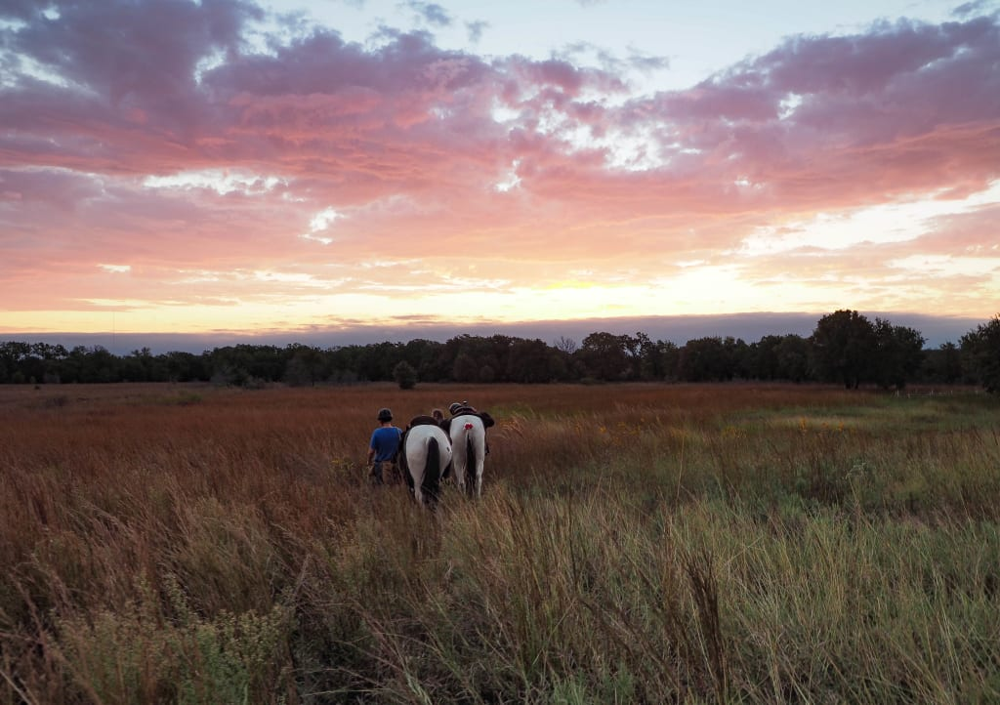

```{r}
library(tidyverse)
library(knitr)
library(DT)
library(plotly)
library(scales)

library(ggeasy)

```


# The Lyndon B. Johnson National Grassland

<center>

<center>


Long through history, the lands that would become the LBJ National Grasslands were favorite hunting grounds for native tribes such as the Cherokee, Creek, Seminole, Waco, and Kickapood [@dferriero_importance_2021]. In fact, the earliest discovered human artifacts in North America, namely remains of animals, seeds, and various others were discovered not far from this region [@noauthor_fort_nodate; @noauthor_human_2023].

In the 1700s and 1800s, the Comanche commanded this region after aquiring horses and beginning a nomadic war tribe-like lifestyle [noauthor_fort_nodate; @association_comanche_nodate]. In 1843, negotiations between these and other tribes with the likes of Sam Houston's deligate generals, Edward J. Tarrant and George W. Terrell saw the natives relocated to territory west of a line through the future site of Fort Worth, giving this town its famous slogan "Where the West Begins"... Not because of its cowboy culture, but rather because this is what the line was referred to as. The second president of Texas, Mirabeau Lamar, did not recognize these treaties for peace, and called for the "total extinction or total repulsion" of the natives as white settlement in the region expanded [noauthor_human_2023; @noauthor_native_nodate].

Ranching has always been historically associated with Texas, and Fort Worth was home to some of the largest cattle trades in the world. Ranchers would drive their cattle from throughout the Great Plains to be sold or traded at the Fort Worth stockyard [@noauthor_home_nodate].

As such, the grasslands surrounding Fort Worth became essential grazing lands along the final legs of cattle drives. The approximately 20,250 acres surrounding Black Creek Lake Northwest of Fort Worth was soon worked extensively by cattle drivers and homesteaders alike. With a steady influx of homesteaders across the great plains, land mismanagement become a major problem, eventually culminating in the dust bowl, which devestated the natural resources of the region [@noauthor_human_2023]. 

President Hoover then began researching agricultural remedies, and his successor, Franklin D. Roosevelt ended land giveaways and began federal management of certain natural lands, including these regions. With well-placed fencing, rotation, and grazing restrictions, vegetation returned to the region around mid-century [@noauthor_human_2023].

Today, the LBJ National Grasslands are federally managed multiple-use areas. They are protected from being developed or plowed, but still allow limited drilling for the oil and gas industry, grazing for ranching, hunting, camping, and general tourism [@noauthor_national_nodate]. 


```{r}
Project_MAGs <- read.csv("Project_MAGs.csv") 
```

```{r}
Project_MAGs_LBJ <- Project_MAGs %>% 
  filter(Site == "National Grasslands LBJ, Texas, USA")
```

# Exercise 3 

## National Grasslands LBJ MAGs Overview 

```{r, fig.width = 9, fig.height = 5}
Project_MAGs_LBJ %>% 
ggplot(aes(x = fct_rev(fct_infreq(Phylum)))) +
    geom_bar(color = "cyan") +
    labs(title = "Phylum Counts for MAGs at National Grasslands LBJ, Texas, USA", x = "Phylum", y = "Number of MAGs") +
theme(axis.text.x = element_text(size = 15, angle = 0, hjust = 1, vjust = 1),
                        axis.text.y = element_text(size = 15),
                        text = element_text(size = 15), plot.title = element_text(size = 17, hjust = 2))+
  coord_flip() 
```

```{r, fig.width = 9, fig.height = 5}
Project_MAGs_LBJ %>% 
ggplot(aes(x = fct_rev(fct_infreq(Class)))) +
    geom_bar(color = "cyan") +
    labs(title = "Class Counts for MAGs at National Grasslands LBJ, Texas, USA", x = "Class", y = "Number of MAGs") +
theme(axis.text.x = element_text(size = 15, angle = 0, hjust = 1, vjust = 1),
                        axis.text.y = element_text(size = 12),
                        text = element_text(size = 15), plot.title = element_text(size = 17, hjust = -2))+
  coord_flip() 
```

```{r}
Project_MAGs_LBJ %>% 
ggplot(aes(x= Total.Number.of.Bases)) +
  labs(title = "Genome Size Analysis for MAGs at National Grasslands LBJ, Texas, USA", x = "Total Number of Bases", y = "Number of MAGs") +
  geom_histogram(bins = 20, color = "cyan") +
  scale_x_continuous(breaks = seq(0, max(Project_MAGs_LBJ$Total.Number.of.Bases), by = 1000000)) +
  theme(axis.text.x = element_text(size = 15, angle = 45, hjust = 1, vjust = 1),
                        axis.text.y = element_text(size = 12),
                        text = element_text(size = 15), plot.title = element_text(size = 15, hjust = 1))


```
```{r}
datatable(Project_MAGs_LBJ)
```


# Exercise 4

## IMG Data for National Grasslands LBJ, Filtered by Re-annotation

```{r}
Site_IMG <- read_tsv("data/exported_img_data.tsv")  #Loading TSV of IMG data for LBJ site
Site_IMG_annotated <- Site_IMG %>% 
  filter(grepl("re-annotation", `Genome Name / Sample Name`))
datatable(Site_IMG_annotated)
```


# Actinobacteria

<center>

<center>


Actinobacteria are diverse, gram positive bacteria found in both aquatic and terrestrial environments [@servin_evidence_2008]. In soil, they are decomposers of organic matter and play a key role in the carbon cycle. This niche is likely distinct from decomposers such as fungi, as they often form symbiotic relationships with plants as nitrogen fixers [@kakoi_isolation_2014].

Interestingly, for a long time Actinomycetota colonies were believed to be fungi as they form extensive mycelia. This is how they were actually named (myc being derived from the Greek "myket" for "mushroom") [@buchanan_studies_1917]. 

Certain Actinomycetota are important members of the human microbiome. In fact, the genus Bifidobacterium are the most common bacteria in the human infant microbiome [@turroni_diversity_2012]. In the intestines, bifidobacteria help maintain the mucosal barrier and play a key role in reduction of inflammation by reducing lipopolysacharides in the GI tract [@pinzone_microbial_2012].

Actinobacteria are also relevant to human disease. Some members of the genus Mycobacterium, for instance, are pathogenic and are the cause of diseases such as tuberculosis, leprosy, diptheria, vaginosis, and others [@lewin_evolution_2016]. Still others from the genus Steptomyces are a major source of common antibiotics used in medicine [@de_lima_procopio_antibiotics_2012].

# Analysis


## Actinobacterioda abundance at each site

```{r}
# Load the MAGs table
Project_MAGs <- read.csv("Project_MAGs.csv")

# Filter all other classes besides ours
actino <- Project_MAGs %>% 
  filter(Phylum == "Actinobacteriota")

#Make a bar plot of the basic counts of Actinobacteria per site

actino %>% 
  count(Site) %>% 
  ggplot(aes(x = reorder(Site, n), y = n)) +
  geom_col(stat = "identity", fill = "blue") +
  xlab("Site") +
  ylab("Count") +
  labs(xolour = "darkblue", size = 10) +
  theme(axis.text.x = element_text(colour = "darkblue", size = 10)) +
  theme(axis.title = element_text(colour = "darkblue")) +
  theme(axis.text.y = element_text(colour = "darkblue", size = 10)) +
  theme(axis.text.y = element_text(size = 4)) +
  scale_x_discrete(labels = wrap_format(25)) +
  theme(axis.text.x = element_text(size = 8)) +
  scale_y_continuous(n.breaks = 12) +
  coord_flip()
```

Interestingly, actinobacteriota is found most predominantly at National Grasslands LBJ, our site! We can also take a look and see some of the lower level taxonomic breakdown of these actinobacteriota: 

### Taxonomic Breakdown of Actinobacteriota at Sites

#### Class

```{r}
actino %>% 
ggplot(aes(x = fct_rev(fct_infreq(Site)), fill = Class)) +
  geom_bar(position = position_dodge2(width = 0.5, preserve = "single")) +
 theme(legend.position = "bottom") +
  theme(legend.justification = "left") +
  theme(legend.key.size = unit( 0.1, 'cm')) +
  theme(legend.key.height = unit(0.1, 'cm')) +
  theme(legend.key.width = unit(0.1, 'cm')) +
  theme(legend.title = element_text(colour = "black", size = 4, face = "bold")) +
  theme(legend.text = element_text(colour = "black", size = 4)) +
  theme(legend.box.background = element_rect()) +
  theme(legend.box.margin = margin(10, 10, 10, 10)) +
  theme(legend.box.just = "left") +
  theme( axis.text.x = element_text(size = 6)) +
  theme(axis.line.y = element_line(linewidth = 0.25)) +
  scale_x_discrete(labels = wrap_format(50)) +
  scale_y_continuous(n.breaks = 12) +
  theme(axis.text.y = element_text(size = 3)) +
  xlab("Site") +
  ylab("Count") +
  labs(title = str_wrap("Number of Actinobateriota Classes at each Site", width = 30)) +
  ggeasy::easy_center_title() +
  coord_flip() 
```

#### Order

```{r, fig.width = 13, fig.height = 5}
Project_MAGs %>%
  filter(Phylum == "Actinobacteriota") %>%
  filter(Site != "NEON combined assembly") %>% 
ggplot(aes(x = fct_rev(fct_infreq(Order)), fill = Site)) +
    geom_bar() +
    labs(title = "Sub Taxonomy of Actinobacteriota, Order (Colored by Site)", x = "Order", y = "Number of MAGs") +
theme(axis.text.x = element_text(size = 15, angle = 0, hjust = 1, vjust = 1),
                        axis.text.y = element_text(size = 12),
                        text = element_text(size = 15), plot.title = element_text(size = 17, hjust = 1.5))+
  coord_flip() 
```

#### Family 

```{r, fig.width = 13, fig.height = 10}
Project_MAGs %>%
  filter(Phylum == "Actinobacteriota") %>%
  filter(Site != "NEON combined assembly") %>% 
ggplot(aes(x = fct_rev(fct_infreq(Family)), fill = Site)) +
    geom_bar() +
    labs(title = "Sub Taxonomy of Actinobacteriota, Family (Colored by Site)", x = "Family", y = "Number of MAGs") +
theme(axis.text.x = element_text(size = 15, angle = 0, hjust = 1, vjust = 1),
                        axis.text.y = element_text(size = 12),
                        text = element_text(size = 15), plot.title = element_text(size = 17, hjust = 1.5))+
  coord_flip() 
```


#### Genera

```{r}
actino %>% 
ggplot(aes(x = fct_rev(fct_infreq(Site)), fill = Genus)) +
  geom_bar(position = position_dodge2(width = 0.5, preserve = "single")) +
  guides(fill = guide_legend(ncol = 3)) +
  theme(legend.justification = "top") +
  theme(legend.position = "left") +
  theme(legend.key.size = unit( 0.1, 'cm')) +
  theme(legend.key.height = unit(0.1, 'cm')) +
  theme(legend.key.width = unit(0.1, 'cm')) +
  theme(legend.title = element_text(colour = "black", size = 2, face = "bold")) +
  theme(legend.text = element_text(colour = "black", size = 2)) +
  theme(legend.box.background = element_rect()) +
  theme(legend.box.margin = margin(4, 4, 4, 4)) +
  theme(legend.box.just = "left") +
  theme( axis.text.x = element_text(size = 4, angle = 90)) +
  theme(axis.line.y = element_line(linewidth = 0.25)) +
  theme(axis.title = element_text(size = 5)) +
  theme(axis.text.y = element_text(size = 4)) +
  scale_x_discrete(labels = wrap_format(40)) +
  scale_y_continuous(limits = c(0, 20)) +
  xlab("Site") +
  ylab("Count") +
  labs(title = str_wrap("Actinobateriota Genera at each Site", width = 30)) +
  ggeasy::easy_plot_title_size(size = 8) +
  ggeasy::easy_center_title()
```

## Pathogens

Which of these sites have some nasty pathogenic Actinobacteria?

```{r}
# Filter for serious pathogenic genera

actino %>% 
  filter(Genus == "Mycobacterium") %>% 
  count(Site) %>% 
  ggplot(aes(x = reorder(Site, n), y = n)) +
  geom_col(stat = "identity", fill = "red") +
  xlab("Site") +
  ylab("Count") +
  labs(colour = "darkred", size = 10) +
  theme(axis.text.x = element_text(colour = "darkred", size = 10)) +
  theme(axis.title = element_text(colour = "darkred")) +
  theme(axis.text.y = element_text(colour = "darkred", size = 10)) +
  theme(axis.text.y = element_text(size = 4)) +
  scale_x_discrete(labels = wrap_format(25)) +
  theme(axis.text.x = element_text(size = 8)) +
  scale_y_continuous(limits = c(0, 8)) +
  labs(title = str_wrap("Mycobacterium tuberculosis Counts at each Site", width = 30)) +
  ggeasy::easy_all_text_color("darkred") +
  ggeasy::easy_center_title() +
  coord_flip()

  
```

## Were these reads high quality?

```{r}
quality <- 
  actino %>% 
  filter(Genus == "Mycobacterium") %>% 
  count(`Bin.Quality`, sort = TRUE)

datatable(quality)
```

So we see only two were really high quality reads. Let's see which they were.

```{r}

quality <- 
  actino %>% 
  filter(Genus == "Mycobacterium") %>% 
  select(c(`Site`, `Sample.Name`, `Subplot`, `Date`, `Bin.Quality`)) %>% 
  filter(Bin.Quality == "HQ")

datatable(quality)
```

So maybe wash your hands in Watershed, Alaska.


# References